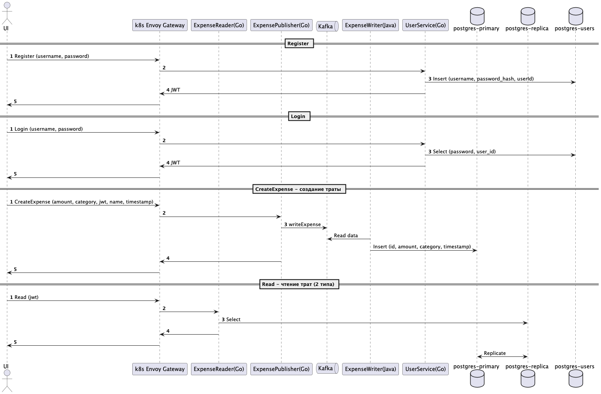

# [SCRUM отчет](https://docs.google.com/document/d/12m2VjNUMp3n863Z9HggvI9V1VDeuy3hqNhIG7fsSjnA/edit?usp=sharing)
# [IDR отчет](IDR.pdf)

# Функциональные требования к проекту "Трекер финансов Монетка"

## 1. Авторизация и регистрация

### 1.1. Регистрация пользователя
- Пользователь может зарегистрироваться, указав:
    - Email (валидный формат, уникальность)
    - Пароль (минимум 9 символов)

### 1.2. Вход в систему
- Пользователь может войти, указав email и пароль

### 1.3. Обработка ошибок авторизации
- При неверных данных отображается сообщение об ошибке

### 1.4. Выход из системы
- Пользователь может выйти из аккаунта

## 2. Создание чека

### 2.1. Форма создания чека
Обязательные поля:
- Название
- Сумма (число > 0)
- Категория (выбор из существующих или создание новой)
- Дата (устанавливается текущая по умолчанию)

### 2.2. Сохранение чека
- После успешного создания чек сохраняется и отображается в списке

### 2.3. Обработка ошибок
- При ошибках валидации отображаются соответствующие сообщения

## 3. Просмотр списка чеков

### 3.1. Отображение чеков
- Список чеков группируется по категориям
- Для каждого чека отображается:
    - Название
    - Сумма
    - Дата

## 4. Управление категориями

### 4.1. Список категорий
- Отображаются все созданные категории

### 4.2. Просмотр чеков по категории
- При нажатии на категорию показываются все относящиеся к ней чеки

## 5. Обработка ошибок и загрузка

### 5.1. Индикатор загрузки
- Отображается при загрузке данных

### 5.2. Обработка ошибок соединения
- При проблемах с сетью показывается сообщение с возможностью повтора запроса

## 6. Дополнительные требования

### 6.1. Валидация данных
- Все поля проходят проверку на корректность ввода

## Об архитектуре

Диаграмма взаимодействия 

- Весь трафик с UI проксируется через Envoy
- Traefik выполняет функцию маршрутизации через заголовки метаданных (переход на роутинг по префиксам будет в следующей версии)
- Мкиросервисная архитектура, основанная на принципе сегрегации операций чтения и записи

# Запуск проекта

1. Скачать minikube
2. minikube start
3. установить helm чарты из папки helm
4. 

### Backend.Troubleshooting

- Не поднимается replica-db / в логах есть ошибка выполнения команды  pg_basebackup
- Причина: pg_basebackup требует пустой папки с данными postgres
- Решение: удалить папку, которая указана в volume у replica-db, перезапустить контейнер

- Запрос в UserService/ ReadService падает с ошибкой подключения к бд
- Причина: не поднят контейнер / сервис на Go не успел подключиться
- Решение: отдельно переподнять БД и сервисы с ней взаимодействующие
